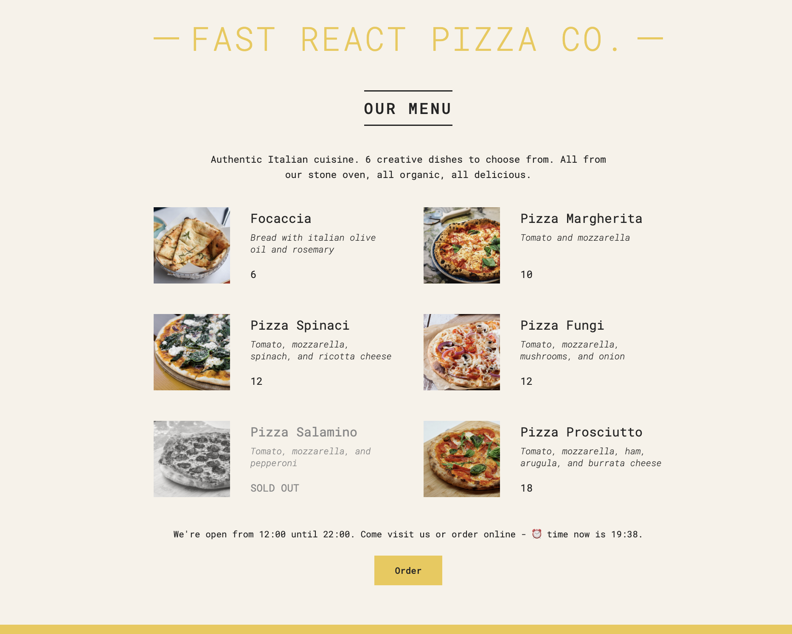
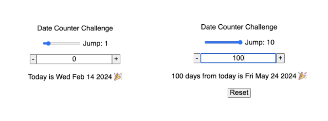
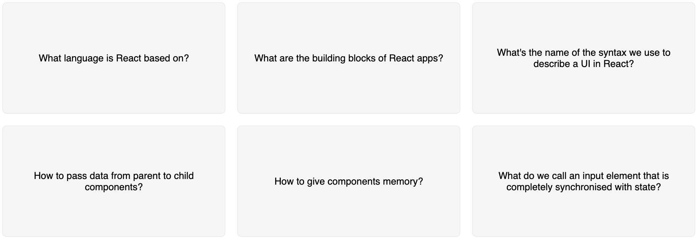
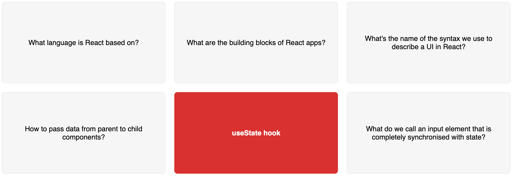

# React-practice

## 01-JS-review

## 02-dev-profile-card

Conditionally setting the skills and their colors, and using the && operator to display the emojis.

## 03-pizza-menu

Using the ternary operator to dynamically display text and change classNames, and rendering an array of pizza objects into components.

## 04-steps

## 04.1-date-counter-challenge-v1

Using useState to update the jumps and counts.

## 04.1-date-counter-challenge-v2

Add a slider (input element, from 1 to 10) for the jumps, accept the count as a user input, and add a reset button (only visible after the original values change) which will bring the slider to 1 and counter to 0.

## 05-travel-list

## 05.1-flashcards

Using useState to update display the flashcards questions and answers.

